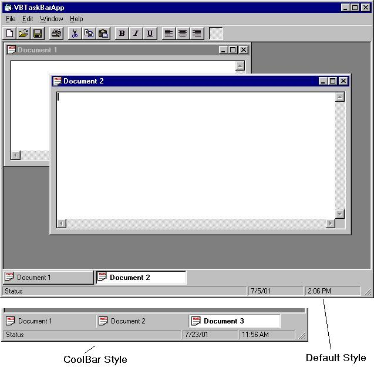

<div align="center">

## UPDATE:  MDI Task Bar control 1\.6


</div>

### Description

ADDED: AutoHide features.<br>

Control can be downloaded/viewed from: <br>

http://www.planetsourcecode.com/xq/ASP/txtCodeId.24861/lngWId.1/qx/vb/scripts/ShowCode.htm
 
### More Info
 


<span>             |<span>
---                |---
**Submitted On**   |
**By**             |[Gregg Housh](https://github.com/Planet-Source-Code/PSCIndex/blob/master/ByAuthor/gregg-housh.md)
**Level**          |Intermediate
**User Rating**    |3.7 (11 globes from 3 users)
**Compatibility**  |VB 6\.0
**Category**       |[Custom Controls/ Forms/  Menus](https://github.com/Planet-Source-Code/PSCIndex/blob/master/ByCategory/custom-controls-forms-menus__1-4.md)
**World**          |[Visual Basic](https://github.com/Planet-Source-Code/PSCIndex/blob/master/ByWorld/visual-basic.md)
**Archive File**   |[](https://github.com/Planet-Source-Code/gregg-housh-update-mdi-task-bar-control-1-6__1-25497/archive/master.zip)


### Source Code

```
ADDED: AutoHide features.<br>
Control can be downloaded/viewed from: <br>
http://www.planetsourcecode.com/xq/ASP/txtCodeId.24861/lngWId.1/qx/vb/scripts/ShowCode.htm
```

